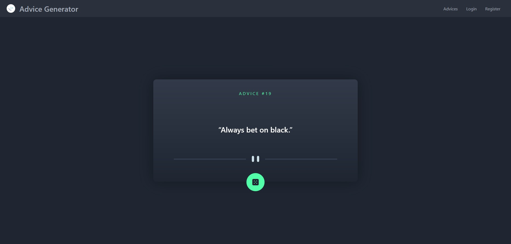

# Frontend Mentor - Advice Generator App

This is a solution to the [Advice Generator App on Frontend Mentor](https://www.frontendmentor.io/challenges/advice-generator-app-QdUG-13db/hub/advice-generator-app-fMi_pluyem). Frontend Mentor challenges help you improve your coding skills by building realistic projects.  

## Table of contents

- [Overview](#overview)
  - [The challenge](#the-challenge)
  - [Screenshot](#screenshot)
  - [Links](#links)
  - [Built with](#built-with)
- [Author](#author)

## Overview

### The challenge

Users should be able to:

- View the optimal layout for the app depending on their device's screen size
- See hover states for all interactive elements on the page
- Generate a new piece of advice by clicking the dice icon

### Screenshot

#### Desktop Layout Screenshot

#### Mobile Layout Screenshot

### Links

- Solution URL: (https://github.com/tiger8707/Advice-Generator-App/)
- Live Site URL: (https://tiger8707.github.io/Advice-Generator-App/)

### Built with

- Grid
- Semantic HTML5 markup
- CSS custom properties
- Flexbox
- Mobile-first workflow
- [Sveltekit](https://kit.svelte.dev/) - JS Framework
- [Tailwind](https://tailwindcss.com/) - For styles
- [Daisy UI](https://daisyui.com/) - Tailwind Components Library
- [Vite](https://vitejs.dev/) - Bundler

## Author

- Website - [Omar Galal](https://github.com/tiger8707/)
- Frontend Mentor - [@tiger8707](https://www.frontendmentor.io/profile/tiger8707)
- LinkedIn - [Omar Galal](https://www.linkedin.com/in/omar-galal-195b40163/)